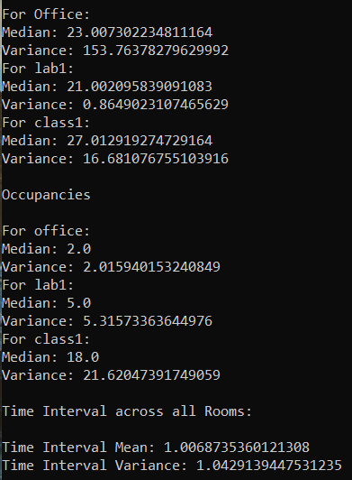
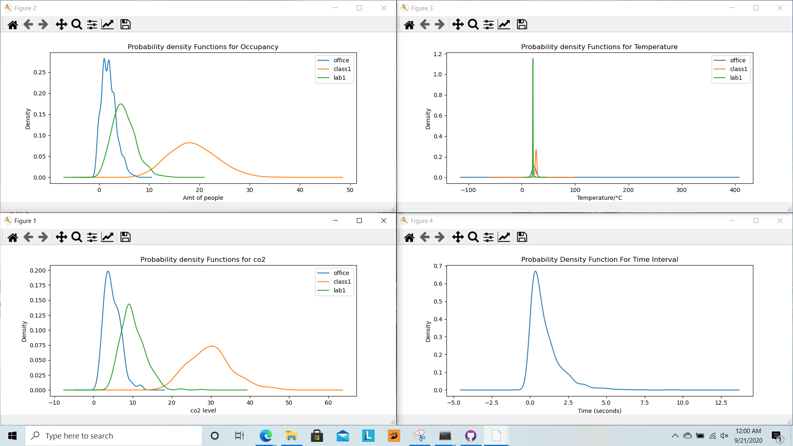

Sensor Mini-Project Memo
Angela Rodriguez Hernandez

Purpose:
Through this Sensor Simulation mini-project, I will be able to use simulated sensors to test for delayed, incorrect, or missing data in proposed designs. I have been provided with the necessary files on GitHub. 

Comments: This was my first time using python and it was difficult to approach this project. I started off with a partner, so it wasn’t too hard at first but it became more difficult when I began to work on my own. This led me to reach out to my peers with questions about why I was getting certain errors. Through this and the use of online resources I was able to complete most of the project. I had a lot of setbacks but I feel more confident in my python skills. I am also glad that I was introduced to a new form of simulating and analyzing data.

Task 0: Set-up
I was able to run the files on my computer. The issued greeting was: ECE Senior Capstone IOT simulator

Task 2: Analysis

Task 3: Design
	A persistent change in temperature does not indicate a failed sensor. These changes can occur due to the location of the sensor. These physical changes can occur to human activity occurring close to the sensor, or it may even indicate the change in the rooms environment, such as windows being opened and closed, or the thermometer being changed manually. Each room type will change according to the season and what type of systems are integrated into the rooms. An office wil; most likely have a heater and AC system. Classrooms from my experience change depending on the building. Olders buildings with no central systems will be harder to manage since the temperature can vary from each classroom.

Task 4: Conclusion 
In the real world companies or other organizations will want to keep track of the temperature, occupancy, and co2 levels in their various rooms. The simulation reflects the information these groups will record. By receiving this information in real time they will be able to track air flow in these rooms so that they may be more energy efficient. These sensors can be customized to automatically turn on the Air conditioner or heater to allow for better conditions within the room. Also, now that a pandemic has changed aspects of our life a system to track these changes can regulate how many people are entering a room. Promoting air flow in rooms is very important now to ensure that the air quality is at its best. There could be a meeting room reserved for various groups in one day. Temperature, occupancy, and co2 levels have to be monitored here because of the various amount of people leaving and entering the room. 
The simulation is deficient when it comes to the accuracy of the sensor. It registers the amount of people entering the room, but will it be able to track the people leaving. If it does not, the occupancy number will not be accurate. Also, the simulation does not account for errors that would happen in the real world. Such as if there were two people walking past a sensor as one was entering and the other was leaving. It would be better for the sensors to reach out to the server. This will allow the server to save space on storage and it will also save power. There may be a day where a classroom is not used at all and if the server were to be polling the sensors it would be a waste of energy. 
The Python websockets were a lot more efficient to use since we only had to run the code once to get 20 mins of data. This saved me a lot of time, since I did not have to run the cd=ode everytime I corrected something.

